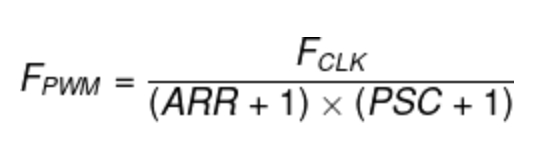

## Generating a PWM output from stm32
- PWM stands for pulse width modulation and is used for controlling the amplitude of digital signals in order to control devices and applications requiring power or electricity.
- I have written a program to generate PWM output at TIM12's channel 1 to dim the on-board LED connected to the same pin(PB14).
- PWM works by using TIMERS present in the microcontroller and it is used for generating an analog signal using a digital source.

**Board Used:** NUCLEO-F767ZI
### PWM Features:
1. **Duty Cycles:**
    - It represents the amount of time the output is HIGH .
    - It is usually calculated in percentages.
    - The CCRx register is responsible for controlling the duty cycle percentage of the PWM signal. This value is calculated by CCRx/ ARR to find the duty cycle percentage value.
2. **Frequency:**
    - The PWM period (1/F<sub>PWM</sub>) is defined by the following parameters: ARR value, the Prescaler value, and the internal clock itself which drives the timer module FCLK.
    <br>

### Procedure:
1. Create a new project in STM32cubeIDE and setup RCC with HSE set as crystal/ceramic resonator.
2. In clock configuration set the APB2 timer frequency as 72MHz(F<sub>CLK</sub>).
3. In the Timers section, Choose TIM12 and set clock source as _internal clock_.
4. In the parameter settings, set prescaler as (72-1) and ARR as (100-1) will yield frequency of 1KHz.
    - F<sub>PWM</sub> = 72MHz / (72*100) = 1KHz.
5. In the code to modify the duty cycle, we will write into the CCRx register.
```
    TIM1->CCR1 = 0; //initial duty cycle.
    HAL_TIM_PWM_Start(&htim12, TIM_CHANNEL_1);
    uint16_t dutyCycle = 0;
```
6. Inside the While loop, change the dutycycle as you want.
```
    dutyCycle+=10;
    if (dutyCycle == 100)dutyCycle = 10;
	TIM12->CCR1 = (uint32_t)dutyCycle;
    HAL_Delay(500);
```

### Output:
 - The on-board Red LED's brightness varies as time progresses(Not visible in video).