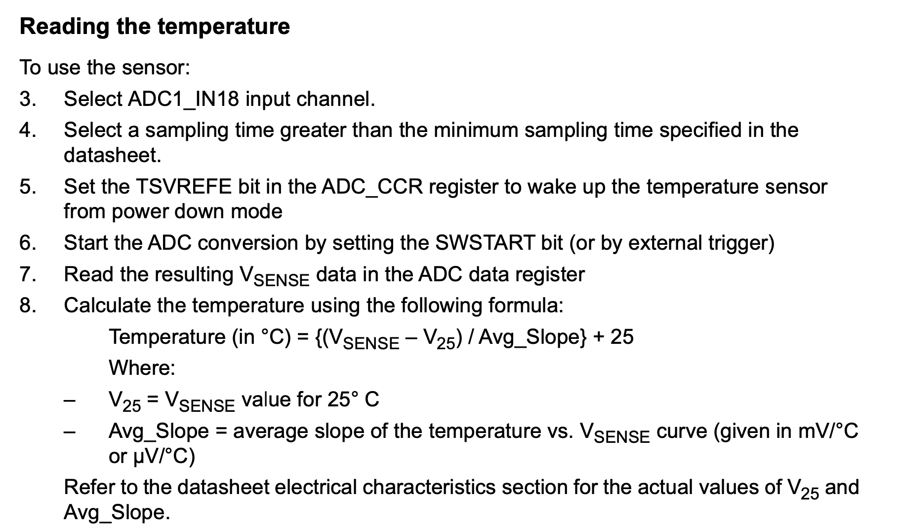
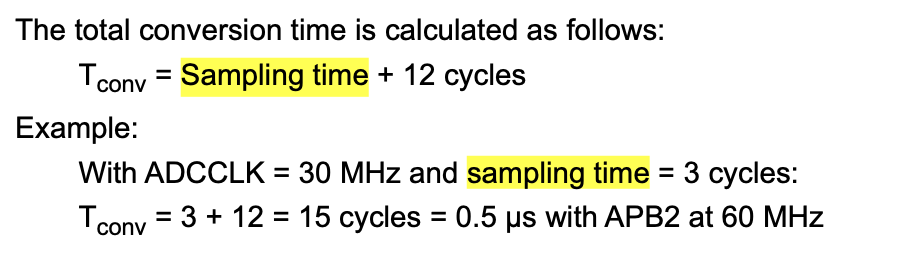
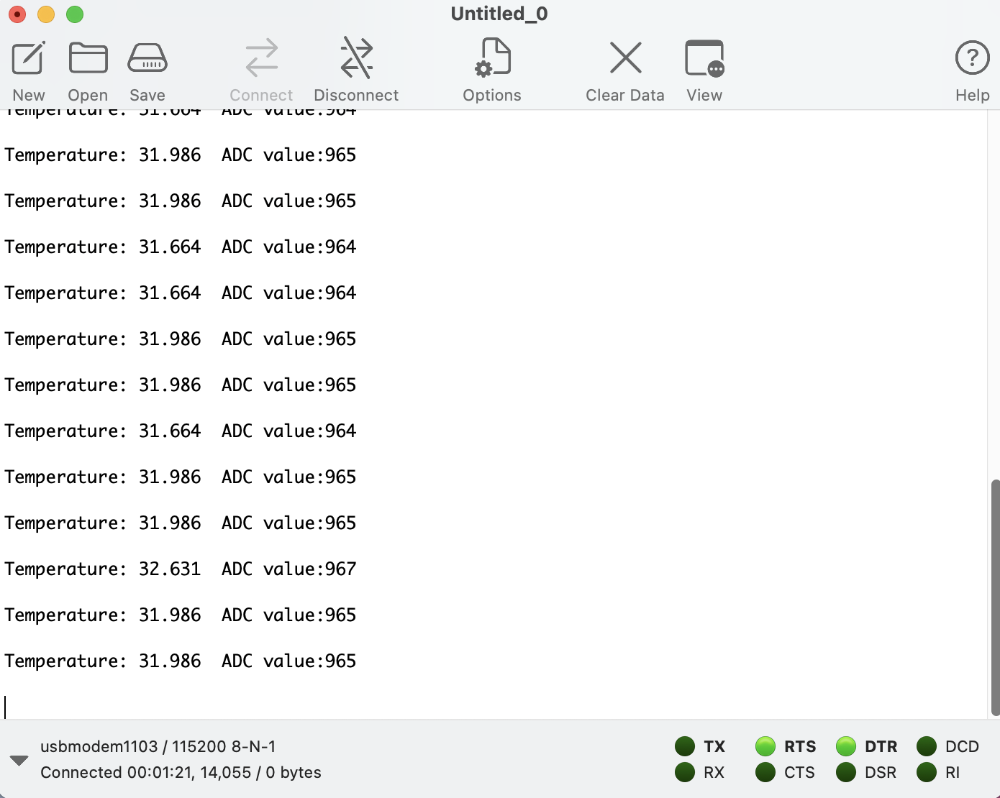

## Reading the analog value from the internal temperature sensor!
- The internal temperature sensor provides the ambient temperature of the device.
    - **Supported temperature range:** –40 to 125 °C 
    - **Precision:** ±1.5 °C
    - **ADC Input Channel:** ADC1_IN18 (for NUCLEO-f767zi board)

**Board Used:** NUCLEO-F767ZI

*No attachment to pins is required as we are using the internal sensor only!*

### Information regarding the ADC
- NUCLEO-F767ZI board comprises a 12-bit ADC with 19 Channels.
- ADC resolution can be configured as 12-bit or 10-bit or 8-bit or 6-bit resolution.
- ADC supply requirements: 2.4 V to 3.6 V at full speed and down to 1.8 V at a slower speed.


**_Note:_** It would be entirely possible to simply read the value of the temperature ADC channel in the main loop of the application, but this would block the processor from doing anything else. A much more elegant way is to use a timer + DMA to make the measurements run entirely in hardware and then just read out the values as and when they are needed.

### Procedure:
- It is completely described in the reference manual of the board.
</img>
- We should set the sampling time more than the minimum sampling time given in the manual.
</img>

- Sampling time can be formulated as


- Open up STM32cubeIDE and create a new project after selecting the board.
- Configure USART3 to view the values in the serial monitor.
- Clock Configuration:
    - In the Systemcore option in the pinout tab, set the RCC clock and set HSE as Crystal/Ceramic Resonator.
    - Now, in the clock configuration tab, select HSE and set the frequency of the APB2 peripheral clock as 30MHz.
    [](../../Assets/ADC_temp/clock%20config_tmp.png)

- ADC Configuration:
    - I'm using ADC1 other ADCs can also be used. Set the ADC mode to the temperature sensor channel.
    - In parameter configurations,
        - Set the resolution as 12-bit
        - Enable the continuous conversion and DMA Continuous Requests.
        - Set channel as Temperature Sensor.
        - Set sampling time as 144 cycles. This is to get the overall sampling time greater than 10us.
            - T<sub>conv</sub> = (144 + 12)/15 = 10.4us
            - 15 is ADCCLK frequency i.e PCLK2/2 = (30/2)
        - In DMA settings, add ADC1 to the DMA request with mode as circular and data width as word and also set the direction as peripheral to memory.

- Generate Code and the logic is added inside the HAL_ADC_ConvCpltCallBack() function.
```
#define Avg_Slope 0.0025
#define V25 0.76
#define VSENSE 3.3/4096

uint32_t ADC_value=0;
float temp = 0;
char data[100];

void HAL_ADC_ConvCpltCallback(ADC_HandleTypeDef* hadc){
	temp = ((VSENSE*ADC_value - V25) / Avg_Slope) + 25;
}
```
- Call the HAL_ADC_Start_DMA(&hadc1,&ADC_value,1) function to start ADC conversion and in the while loop write the code to transmit the converted data to serial monitor.
```
snprintf(data,100,"Temperature: %0.3f  ADC value:%lu\n\r",temp,ADC_value);
HAL_UART_Transmit(&huart3,(uint8_t *)data, 100, 10);
HAL_Delay(500);

```

### Output:
