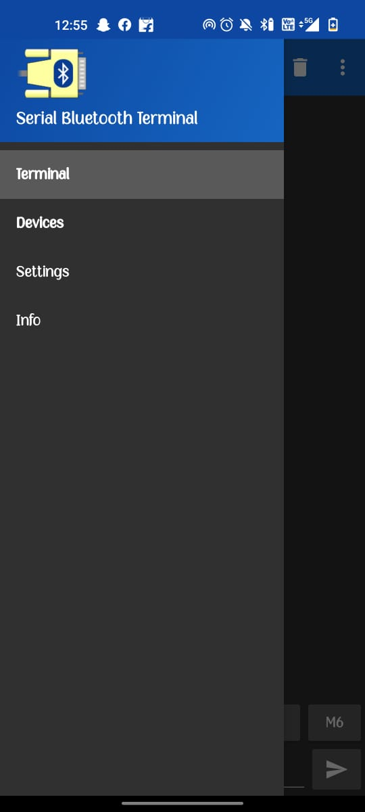
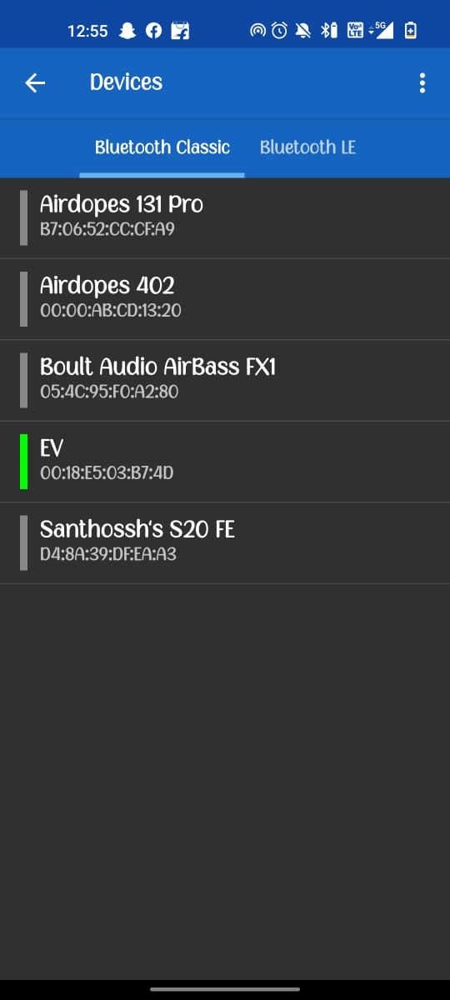
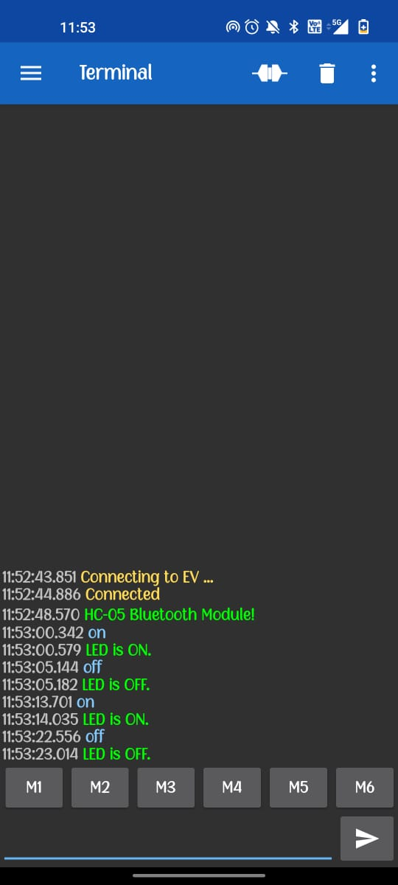

## Sending Data from STM32 to mobile and receiving data from mobile to STM32
- I have used the *HC-05 Bluetooth Module* for sending instructions from mobile to microcontroller.
- Download the **Serial Bluetooth Terminal** app for communicating with the *HC-05 module*.
- More Information regarding the Bluetooth module can be found [Here](https://techzeero.com/sensors-modules/bluetooth-module-hc-05/).

**Board Used:** NUCLEO-F767ZI


### PIN configurations:
1. 5v from STM32 board to 5v pin in the module.
2. GND to GND respectively
3. Tx of the module goes to USART2_RX of the [Board](https://os.mbed.com/platforms/ST-Nucleo-F767ZI/).
4. The Rx of the module goes to USART2_TX of the board.

**Note:** Any USART port can be used for this!

### Instructions:
1. Enable required configurations such as USART2 in the STM32cubeIDE.
2. I'm using the Interrupt Method USART to communicate (non-blocking Mode).
3. Basic Summary of the code I have used:
    - The function checks if the UART instance being used is USART2, as indicated by the condition if (huart->Instance == USART2.This is to ensure that the code is responding only to the UART2 receive events.
    - If the received character recv_char is equal to a carriage return ('\r'), it means that a complete message has been received. A carriage return is often used to terminate a command or message in UART communication.
    - If the received character is a carriage return, the code proceeds to process the received message.
    - First, it transmits the received string (recv_str) back to UART3. It essentially echoes the received message back to another UART interface (UART3).
    - Then, it transmits "\r\n" (carriage return and line feed) to UART3, effectively adding a new line after the echoed message.
    - Next, the code checks if the received message matches the string "on" using the strcmp function. If it does, it sets the GPIO pin B7 to high, effectively turning on an LED. It also sends the message "LED is ON.\r\n" back to UART2 using HAL_UART_Transmit.
    - Similarly, if the received message matches the string "off", it sets the GPIO pin B7 to low, effectively turning off an LED. It also sends the message "LED is OFF.\r\n" back to UART2.
    - After processing the received message, the recv_str buffer is cleared using memset to ensure it is ready for the next received message. The i counter (index of the recv_str buffer) is reset to zero.
    - If the received character is not a carriage return ('\r') or line feed ('\n'), it means it's part of an ongoing message, so it is added to the recv_str buffer.
    - Lastly, the function re-enables UART2 to receive the next character using the HAL_UART_Receive_IT function with the address of recv_char as the receive buffer.

Code Snippet:
```
void HAL_UART_RxCpltCallback(UART_HandleTypeDef *huart)
{
    // Check if the UART instance is USART2
    if (huart->Instance == USART2)
    {
        // Check if the received character is a carriage return '\r'
        if (recv_char == '\r')
        {
            // Transmit the received string (recv_str) to UART3
            HAL_UART_Transmit(&huart3, recv_str, i, HAL_MAX_DELAY);
            // Transmit "\r\n" (carriage return and line feed) to UART3
            HAL_UART_Transmit(&huart3, "\r\n", 2, HAL_MAX_DELAY);

            // Check if the received string matches the string "on"
            if (!strcmp((char *)recv_str, on))
            {
                // Set the GPIO pin B7 to high (LED ON)
                HAL_GPIO_WritePin(GPIOB, GPIO_PIN_7, SET);
                // Transmit "LED is ON.\r\n" to UART2
                HAL_UART_Transmit(&huart2, "LED is ON.\r\n", 12, HAL_MAX_DELAY);
            }
            // Check if the received string matches the string "off"
            if (!strcmp((char *)recv_str, off))
            {
                // Set the GPIO pin B7 to low (LED OFF)
                HAL_GPIO_WritePin(GPIOB, GPIO_PIN_7, RESET);
                // Transmit "LED is OFF.\r\n" to UART2
                HAL_UART_Transmit(&huart2, "LED is OFF.\r\n", 13, HAL_MAX_DELAY);
            }

            // Clear the recv_str buffer and reset the index counter (i)
            memset(recv_str, 0, i);
            i = 0;
        }
        else
        {
            // If the received character is not '\r' or '\n', add it to the recv_str buffer
            if (recv_char != '\r' && recv_char != '\n')
            {
                recv_str[i++] = recv_char;
            }
        }

        // Enable UART2 to receive the next character (interrupt-based reception)
        HAL_UART_Receive_IT(&huart2, &recv_char, 1);
    }
}
```
- This function is automatically called when the RX_buffer is complete after it receives data from the HC-05 module.
- In the main Function, I have called the Recieve function to receive the data
```
HAL_UART_Transmit(&huart2, demo_string, strlen(demo_string), HAL_MAX_DELAY); // It sends a demo string that has been defined beforehand.
HAL_UART_Receive_IT(&huart2, &recv_char, 1); // Recieve via Interrupt function call.

```

### Connecting using the app
1. Open the Serial BLE Terminal app and go to the devices section in the sidebar.<br>

2. Then select the name of the device and wait for it to connect (check if the Bluetooth in mobile is turned on).

3. Once the terminal is open just type on or off to turn on/off the led respectively.
