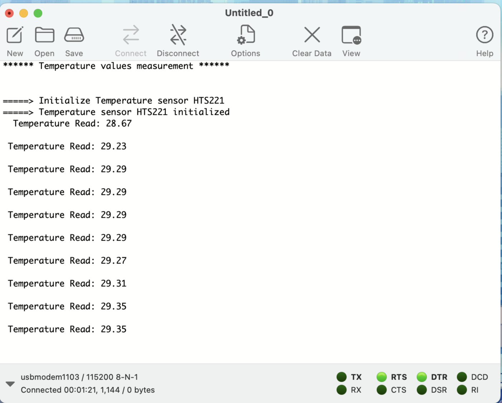

## Getting Temperature & Humidity values using on-board HTS221 sensor in STM32
- STM32 discovery boards are usually equipped with a temperature & humidity sensor.
- As the sensor is on-board no extra interfacing is required.

**Board used:** B-L475EIOT01A1 Discovery Board.

### Instructions:
1. Create a new project in STM32cubeIDE and initialize UART connection to transmit data.
2. Copy Board Support Package Drivers to project directory
    - The BSP (board support package) drivers are available in the STM32CubeL4 package. This provides APIs corresponding to the hardware components of a board.
    - Latest package will be downloaded already at C:\Users\user_name\STM32Cube\Repository\STM32Cube_FW_L4_Vx.xx.x.
    - In the generated project, create a folder project_name/Drivers/BSP.
    - Copy the STM32CubeL4/Drivers/BSP/B-L475E-IOT01 folder and paste it in the project_name/Drivers/BSP folder.
    - Copy the STM32CubeL4/Drivers/BSP/Components folder and paste it under project_name/Drivers/BSP/Components.
3. Now the program to include these files, update the inclue paths
    - Select the relevant project from the Project Explorer perspective
    - From Project menu or File menu, go to Properties > C/C++ Build > Settings > Tool Settings > MCU GCC Compiler > Include paths.
    - Click on Add icon.png to include the new paths. 
    - Add ../Drivers/BSP/B-L475E-IOT01 and ../Drivers/BSP/Components/hts221 paths.
4. In the main.c, do the following changes
    - Include the header files: stm32l475e_iot01.h, stm32l475e_iot01_tsensor.h and math.h
    - Add private values. These values are used to display temperature and messages on the terminal:
    ```
    float temp_value = 0;  // Measured temperature value
    char str_tmp[100] = ""; // Formatted message to display the temperature value
    uint8_t msg1[] = "****** Temperature values measurement ******\n\n\r";
    uint8_t msg2[] = "=====> Initialize Temperature sensor HTS221 \r\n";
    uint8_t msg3[] = "=====> Temperature sensor HTS221 initialized \r\n ";
    ```

    - Initialize the sensor and print the starting messages.
    ```
    HAL_UART_Transmit(&huart1,msg1,sizeof(msg1),1000);
    HAL_UART_Transmit(&huart1,msg2,sizeof(msg2),1000);
    BSP_TSENSOR_Init();// Initializing the sensor.
    HAL_UART_Transmit(&huart1,msg3,sizeof(msg3),1000);
    ```
    - In the while (1) loop, read the temperature value, format it, and then display the message with the measured value on the terminal
    ```
    temp_value = BSP_TSENSOR_ReadTemp();
	snprintf(str_tmp,100," Temperature Read: %0.2f\n\r",temp_value);
	HAL_UART_Transmit(&huart1,(uint8_t *)str_tmp,sizeof(str_tmp),1000);
	HAL_Delay(1000);
    ```

### Output:

