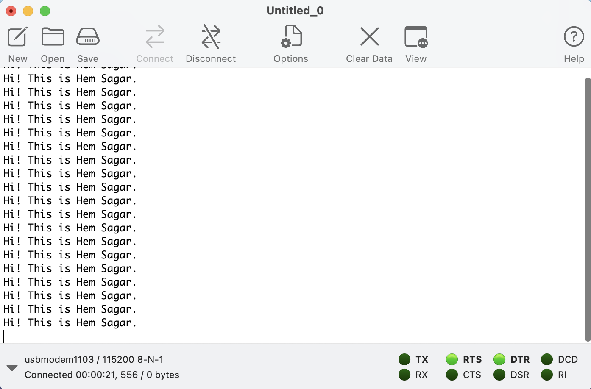

## Serial Communication using UART
- UART is a asynchronous communication protocol in which data is sent serially bit by bit.
- Usually consist of Tx and Rx pins that are connected to Rx and Tx pins of microcontroller respectively.
- These transmissions can be viewed by using a serial monitor.

**Boards Used:** NUCLEO-F767ZI, B-L475EIOT01A1

### Instructions:
1. Create  a new project in STM32cubeIDE with necessary board.
2. Enable the UART/USART pins as Rx and Tx. Then generate the Code.
3. In the main function, define a variable to hold the data to be transmitted.
```
uint8_t Text[] = "Hi! This is Hem Sagar.\r\n";
```
4. In the while loop, use HAL_UART_Transmit() function to transmit the data. Alternatively HAL_UART_Receive() function can be used to recieve data.
```
HAL_UART_Transmit(&huart3, Text, sizeof(Text), 10);
HAL_Delay(1000);
```

Note: Refer [HAL reference](https://web.eece.maine.edu/~hummels/classes/ece486/docs/um1884-description-of-stm32l4l4-hal-and-lowlayer-drivers-stmicroelectronics.pdf) to get insight about parameters to the functions 

### Modes in which UART can be used:
- Blocking Mode:
    - The MCU doesnot do any other work untill the transmission or reception is completed.
    - HAL_UART_Transmit() / HAL_UART_Receive() functions are used.
- Non-Blocking Mode:
    - The MCU does other works simulateously.
    - Achieved by Interrupts or DMA.

### Output:
